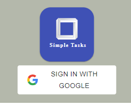
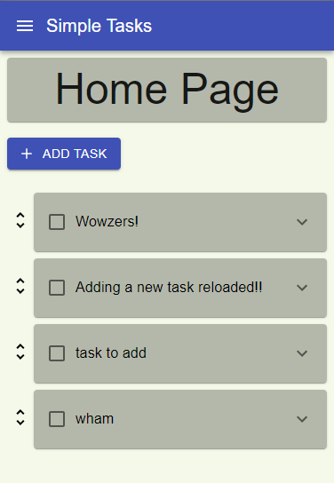
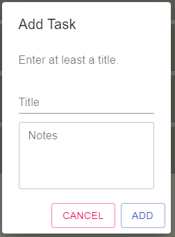
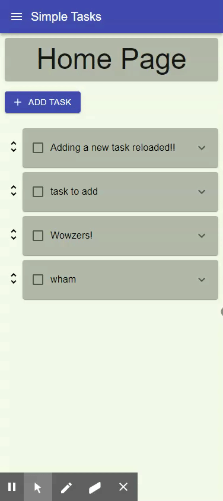
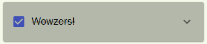
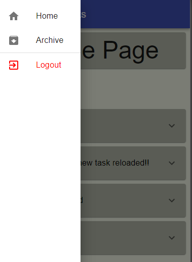
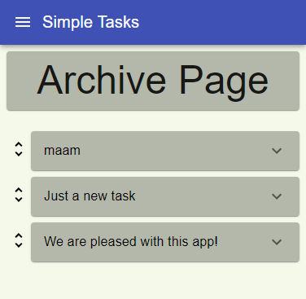

# Simple Tasks

### Purpose  
This is a full stack application for simple task management. Allowing the user to add, prioritize, edit, delete and archive tasks. Built to be simple so the user can focus on finishing their tasks quickly.

### How to use  
The initial page contains a single button for signing in with Google.  

>  

After logging in, the user is presented with the home page.  

>  

This is where the user will spend most of their time.  
From here the user can add a task using the add task button and a modal.  

>  

Each task can be prioritized by grabbing the handle and dragging it.  

>  

Opening a task will show notes as well as three buttons for editting, archiving, and deleting.  

>  

When the user finishes a task, they can click on the task title to cross the task off.  

>

Any archived tasks will be moved to the archive page.  
This page can be reached by using the navigation drawer.  

>  
>  

An app designed for ease of use and swiftness for the end user!

### Deployment  
> http://ec2-3-128-27-125.us-east-2.compute.amazonaws.com

### Technologies  
> React.js, Material-UI, Node.js, Express.js, Passport.js, MongoDB, Mongoose, Ubuntu, AWS  

React.js and Material-UI were used to create and design the front-end of the application.  
Node.js and Express.js were used for the server.  
Passport.js allowed me to integrate google oauth2 authentication for my app with ease.  
I chose to use MongoDB with Mongoose to create the database for simplicity.  
In order to deploy the app, I used an Ubuntu server through Amazon Web Services.  